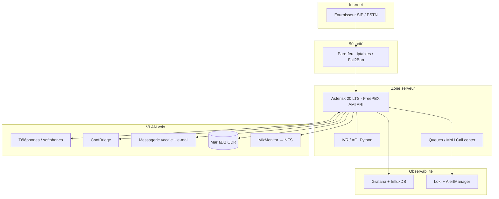

# Architecture VoIP — communication entre composants

Document de synthèse basé sur le schéma d’architecture (réf. visuelle `17b41a91-e7d1-47fc-9cef-4288324538e4.jpg`) et aligné avec l’exploitation documentée dans **`Plan-adressage-reseau-VoIP-QoS.md`** et **`S2-Phase2-Utilisateurs-Extensions.md`**.

---

## 1. Vue d’ensemble

Le système est une plateforme de téléphonie **VoIP** centrée sur **Asterisk 20 LTS** (déployée via **FreePBX**). Les flux vont de l’**Internet** (fournisseur SIP / PSTN) jusqu’aux **terminaux** et **services** sur le **réseau voix** isolé, en passant par une **couche de sécurité**, le **cœur applicatif**, et des briques d’**observabilité**.

Sur le schéma, le VLAN voix est noté **192.168.10.0/24** ; en **production documentée**, le sous-réseau voix retenu est **10.10.10.0/24** (VLAN 10, interface serveur **10.10.10.10**). La logique d’architecture reste la même : remplacer mentalement ce préfixe par celui du plan d’adressage en vigueur.

---

## 2. Couches et rôles

| Zone | Rôle |
|------|------|
| **Internet / Trunk SIP** | Entrée et sortie des appels externes ; connexion au **fournisseur SIP**. |
| **Pare-feu** | Frontière entre Internet et la zone serveur ; filtrage (**iptables**), limitation des abus (**Fail2Ban**). |
| **Zone serveur (LAN / VM)** | Héberge **Asterisk / FreePBX** et les extensions logiques (IVR, files d’attente). |
| **Observabilité** | Métriques temps réel et agrégation des journaux / alertes. |
| **VLAN voix** | Téléphones, softphones, conférences, messagerie, base **CDR**, stockage des enregistrements. |

---

## 3. Communication entre composants (flux principaux)

### 3.1 Trafic externe — PSTN / opérateur

```text
Internet (Trunk SIP / fournisseur)  →  Pare-feu  →  Asterisk 20 LTS
```

- **Protocole** : signalisation **SIP** (souvent **UDP/TCP 5060** ou **TLS 5061** selon l’offre opérateur).
- **Rôle du pare-feu** : n’autoriser que les ports et sources nécessaires ; **Fail2Ban** réduit les tentatives de force brute sur la signalisation.
- **Côté déploiement** : les **routes sortantes** et **trunks** sont la phase suivante dans la doc Phase 2 ; l’interne/externe FreePBX correspond aux contextes **`from-internal`** / **`from-trunk`** / **`from-pstn`**.

### 3.2 Cœur Asterisk — logique métier interne

```text
Asterisk 20 LTS  ↔  IVR / AGI (scripts Python)
Asterisk 20 LTS  ↔  Files d’attente / MoH (call center)
```

- **FreePBX** fournit l’interface de gestion ; **AMI** et **ARI** permettent l’automatisation et l’intégration applicative.
- **AGI** : Asterisk délègue des décisions à des **scripts Python** (menus vocaux, logique métier).
- **Queues / MoH** : mise en attente musicale et **gestion de centre d’appels** ; le dialplan personnalisé (ex. sonnerie groupe **8000**) vit dans **`extensions_custom.conf`** après régénération FreePBX.

### 3.3 Terminaux et média — VLAN voix

```text
Asterisk 20 LTS  ↔  VLAN voix (TLS + SRTP côté clients)
         ├── Téléphones IP / softphones (Zoiper, Linphone, comptes SIP étendus)
         ├── ConfBridge (Meet-Me / conférences)
         ├── Messagerie vocale (+ notification e-mail / WAV)
         ├── MariaDB (CDR)
         └── Enregistrements (MixMonitor → NFS)
```

- **Signalisation** : **SIP** (**5060/UDP**, **5061/TLS** pour Phase 2 documentée).
- **Média** : **RTP** sur la plage **10000–20000** (constatée sur le serveur) ; chiffrement **TLS/SRTP** lorsque les clients le supportent.
- **QoS** : le serveur marque le **RTP** en **DSCP EF** (iptables mangle / UFW) pour priorisation sur le LAN ; les switchs doivent **faire confiance** au marquage ou appliquer leurs propres files prioritaires.

### 3.4 Persistance et enregistrements

| Flux | De → vers | Protocole / mécanisme |
|------|-----------|------------------------|
| **CDR** | Asterisk → **MariaDB** | Requêtes SQL (détail des appels). |
| **Fichiers audio** | Asterisk (**MixMonitor**) → stockage | Souvent montage **NFS** pour centraliser les fichiers. |
| **Messagerie** | `app_voicemail` → e-mail | **SMTP** + pièces jointes WAV (configuration par extension). |

### 3.5 Observabilité

```text
Asterisk 20 LTS  →  Monitoring (InfluxDB + Grafana)
Files / MoH      →  Logs & alertes (Loki + AlertManager)
```

- **Métriques** : collecte depuis Asterisk vers une stack **série temporelle** et tableaux de bord.
- **Journaux** : corrélation des événements (files, appels) pour le diagnostic et les **alertes** opérationnelles.

Les flux exacts (protocoles, agents) dépendent de l’implémentation choisie sur l’infra ; le schéma fixe l’**intention** : séparer **métriques** et **logs**.

---

## 4. Schéma logique des échanges (Mermaid)



---

## 5. Cohérence avec les documents du projet

| Sujet | Lien avec ce schéma |
|-------|---------------------|
| **Deux pattes réseau** | LAN gestion (ex. **192.168.147.0/24**) + **10.10.10.0/24** voix ; **localnets** PJSIP inclut les deux. |
| **Extensions 1001–1010** | Terminaux du VLAN voix ; **TLS 5061**, **G.722**, ring group **8000**. |
| **UFW** | Autorise SIP/RTP depuis **10.10.10.0/24** vers les ports documentés. |
| **Schéma vs plan IP** | Le dessin peut afficher **192.168.10.0/24** ; le **plan d’adressage** officiel du serveur est **10.10.10.0/24**. |

---

## 6. Synthèse en une phrase

**La signalisation et le média circulent entre l’opérateur (trunk), le pare-feu, Asterisk/FreePBX, puis les téléphones et services du VLAN voix** ; **les données structurées (CDR) et les fichiers (messagerie, enregistrements)** partent vers **MariaDB** et le **stockage NFS** ; **la supervision** observe Asterisk et les sous-systèmes critiques (files, logs) via des pipelines **métriques** et **logs** distincts.

---

*Document généré pour expliquer l’architecture du schéma et les communications inter-composants, croisé avec l’état documenté du déploiement FreePBX / VLAN 10.*
